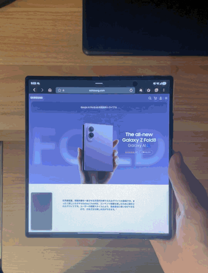

# ZFoldDuo

An experimental Android app that **recreates the iPhone Duo opening and closing animation on Galaxy Z Fold devices**. It follows the hinge angle of the Galaxy Z Fold7 and Fold8 and overlays an iPhone Duo-inspired 3D folding effect across the entire screen.

**This is not a staged animation inside a demo app or a static-screenshot mockup.** ZFoldDuo runs as a system-wide overlay across Android and other apps, responds continuously to the physical hinge, and coordinates the real inner and cover displays. Live screen content remains part of the rendered transition.

> [!IMPORTANT]
> ZFoldDuo is a proof of concept exploring whether the iPhone Duo animation can be recreated on Galaxy Z Fold devices. It is not currently stable or ready for everyday use. More device testing and development are needed before it can become a reliable app. Bug reports, results from different OS builds, UI and architecture ideas, and code contributions are all welcome. Join the [Discord server](https://discord.gg/3ZgZKwJhKz) to participate and exchange information. See [CONTRIBUTING.md](CONTRIBUTING.md) for development guidelines.

## Demo



## Features

- System-wide operation across the Android UI and other apps
- Continuous animation driven by Samsung's internal hinge angle
- Display transitions spanning the inner and cover screens
- Live frames that reflect changes in the content behind the overlay
- World-space projection based on a pinhole camera model
- Automatic cleanup when the hinge angle remains nearly unchanged for one second
- ADB connection that runs entirely on the device

## Supported environment

- Galaxy Z Fold7
- Galaxy Z Fold8
- Android 16 or later
- Wireless debugging
- Accessibility service

The app may also work on the Galaxy Z Fold6 and earlier models, but these devices have not been tested.

ZFoldDuo relies on private Samsung interfaces and the Fold series' device-specific display architecture. It may not work on every device or system version.

## Setup

1. Install the APK.
2. Enable Wireless debugging in Developer options.
3. Open **Pair device with pairing code**.
4. Enter the six-digit code shown in ZFoldDuo.
5. Enable the ZFoldDuo service in Android's Accessibility settings.

The pairing key is stored in the app's private storage. A PC connection is not required during normal use.

## How it works

ZFoldDuo reads the internal hinge angle used by Samsung's system wallpaper component through an on-device ADB session. Its accessibility overlay is attached at the system level rather than to one app activity, so the effect follows whatever is currently visible on the device. During a display transition, it tracks Android's logical displays and the physical panels separately, temporarily keeping only the required displays powered at the same time.

The rendering engine treats each captured frame as a virtual glass surface. It calculates the projected position from the distance to the hinge, distance to the viewer, and rotation of the surface, then uses AGSL to apply depth-dependent frosting and dimming.

Screen capture is used only as the live texture source for the system-wide effect; the animation is not a prerecorded or frozen screenshot trick. The frames are refreshed from the active display while the geometry continues to follow the physical hinge. The overlay itself does not receive touch input and is excluded from capture, preventing it from recursively appearing inside its own live frames.

## Privacy

- Screen frames are processed in memory only while an animation is active.
- Frames are never saved to files.
- Frames and hinge-angle data are never sent to external servers.
- Network permission is used only for the on-device wireless debugging connection and mDNS discovery.
- Secure screens protected by Android cannot be captured.

## Building

Requirements:

- JDK 17
- Android SDK 37

```bash
./gradlew testDebugUnitTest lintDebug assembleDebug
```

Output:

```text
app/build/outputs/apk/debug/app-debug.apk
```

Do not include release-signing configuration in the public repository.

## Project structure

```text
app/src/main/java/com/foldduo/hinge/
├── AngleRuntime.kt                 On-device ADB connection and display-state commands
├── EmbeddedAdbAngleClient.kt      Internal hinge-angle stream
├── capture/                       Live-frame transport over Binder
├── effect/                        Projection model, motion tracking, and frame smoothing
└── overlay/                       Display state machine and GPU-rendered views

app/src/main/res/raw/
└── spatial_projection.agsl        World-space projection and frosting shader
```

## Caveats

- This is an unofficial project that imitates the iPhone Duo opening and closing effect. It is not provided, endorsed, or supported by Apple or Samsung.
- Changes to private APIs may break the app without notice.
- Accessibility permission is used to display a touch-through overlay across the entire screen.
- If the app is force-stopped during a display transition, fold or unfold the device—or restart it—to restore the standard display state.

## Contributing

Join the [Discord server](https://discord.gg/3ZgZKwJhKz) to share test results, ideas, and questions. For code contributions, read [CONTRIBUTING.md](CONTRIBUTING.md). Bug reports should include the device model, Android build number, reproduction steps, and relevant `ZFoldDuoEngine` logs. Do not attach personal information or screen content.

## License

This project is available under the [MIT License](LICENSE). Third-party libraries are listed in [THIRD_PARTY_NOTICES.md](THIRD_PARTY_NOTICES.md).
